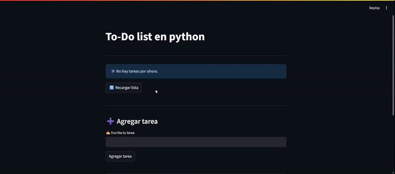
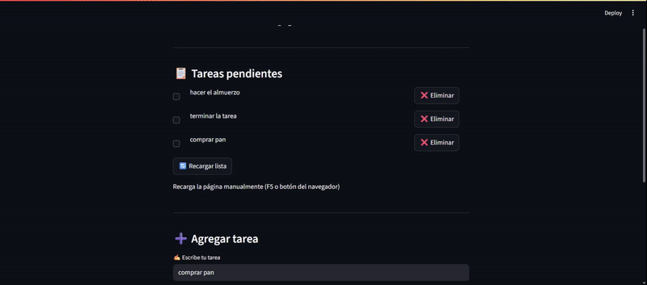

# 📝 To-Do List en Python

Este proyecto es una aplicación web de lista de tareas (To-Do List) desarrollada en Python. Utiliza **Streamlit** para la interfaz de usuario y **FastAPI** como backend para gestionar las tareas. Permite agregar, marcar como completadas, eliminar tareas individuales o eliminar todas las tareas.

## Características

- **Agregar tareas:** Escribe y añade nuevas tareas a la lista.
- **Marcar tareas como completadas:** Usa el checkbox para marcar tareas hechas.
- **Eliminar tareas:** Borra tareas individuales o todas a la vez.
- **Interfaz intuitiva:** Visualiza y gestiona tus tareas de forma sencilla y rápida.
- **Comunicación API:** El frontend se comunica con el backend mediante peticiones HTTP (GET, POST, PUT, DELETE).

## 🚀 Demostración en acción  

### ➕ Agregar tareas  
  

---

### 📋 Gestionar lista de tareas  
  

---

## Tecnologías utilizadas

- [Streamlit](https://streamlit.io/) para la interfaz web.
- [FastAPI](https://fastapi.tiangolo.com/) para la API REST.
- [Requests](https://docs.python-requests.org/) para la comunicación HTTP entre frontend y backend.


## Estructura del proyecto

```
To Do List/
│
├── front.py        # Código de la interfaz Streamlit
├── backend.py      # (Ejemplo) Código de la API FastAPI
└── README.md       # Este archivo
```

## Requisitos

- Python 3.8 o superior
- Instalar dependencias:
  ```
  pip install streamlit fastapi uvicorn requests
  ```

## Cómo ejecutar el proyecto

1. **Inicia el backend (FastAPI):**
   ```bash
   uvicorn backend:app --reload
   ```
   Esto levantará la API en `http://127.0.0.1:8000`.

2. **Inicia el frontend (Streamlit):**
   ```bash
   streamlit run front.py
   ```
   Abre el navegador en la dirección que te indique Streamlit (por defecto suele ser `http://localhost:8501`).

## Personalización

Puedes modificar el archivo `front.py` para cambiar la apariencia o agregar nuevas funcionalidades a la lista de tareas.

## Notas

- Asegúrate de que el backend esté corriendo antes de iniciar el frontend.
- El archivo `backend.py` debe implementar los endpoints necesarios para manejar las tareas (GET, POST, PUT, DELETE).

---

¡Disfruta organizando tus tareas con esta To-Do List en Python!
